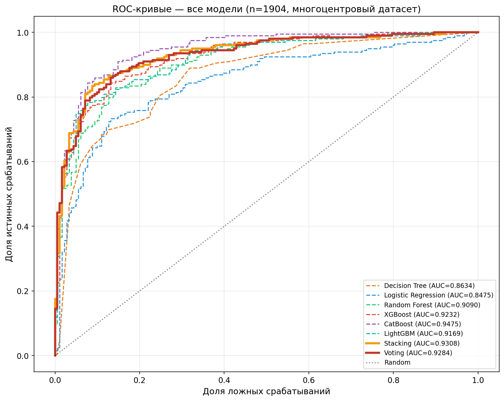
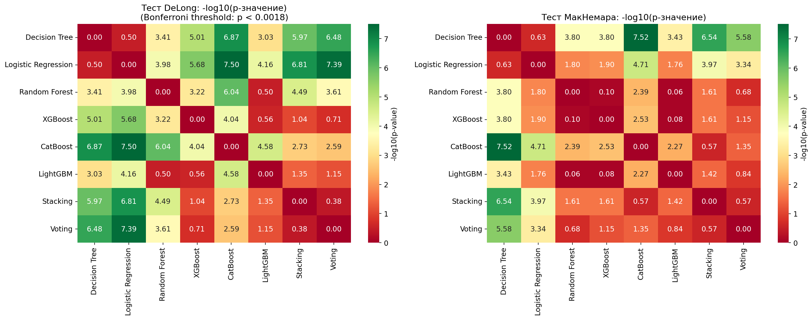
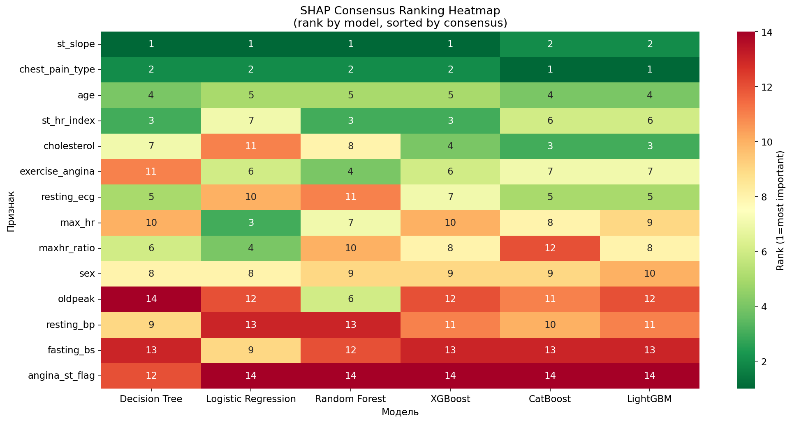
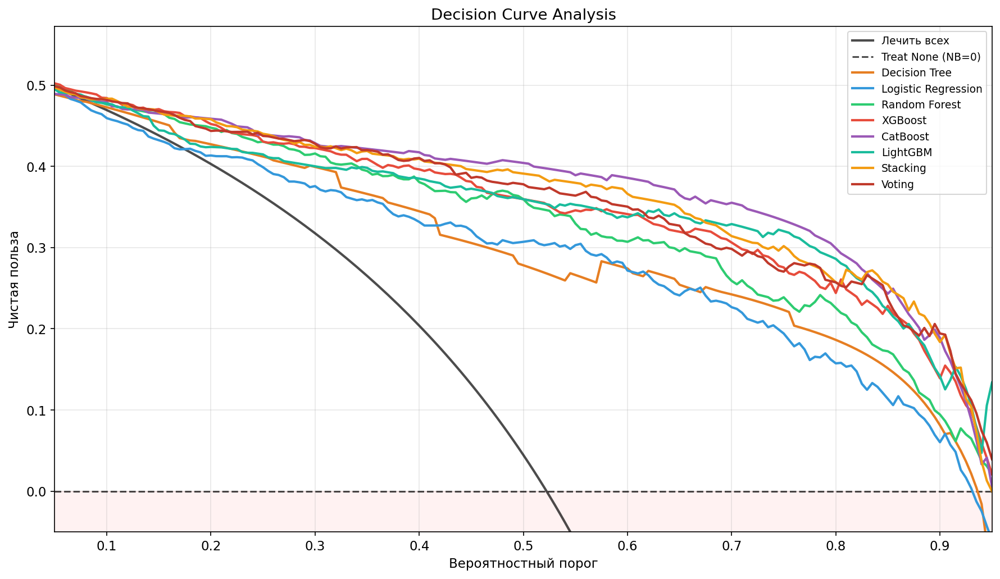
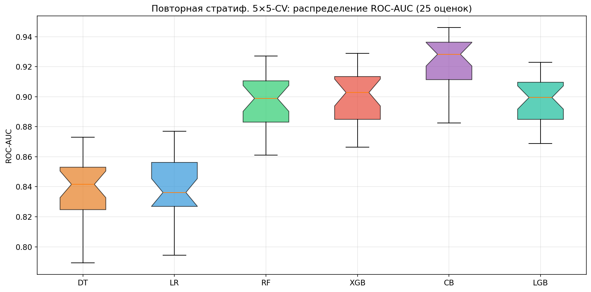
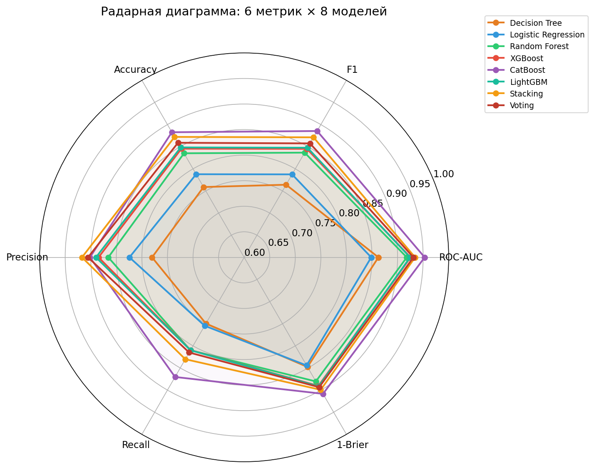
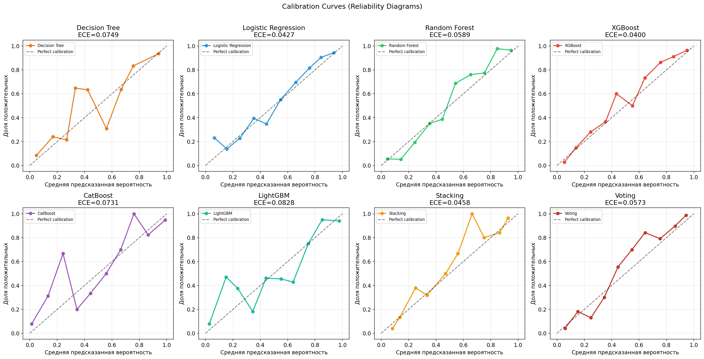
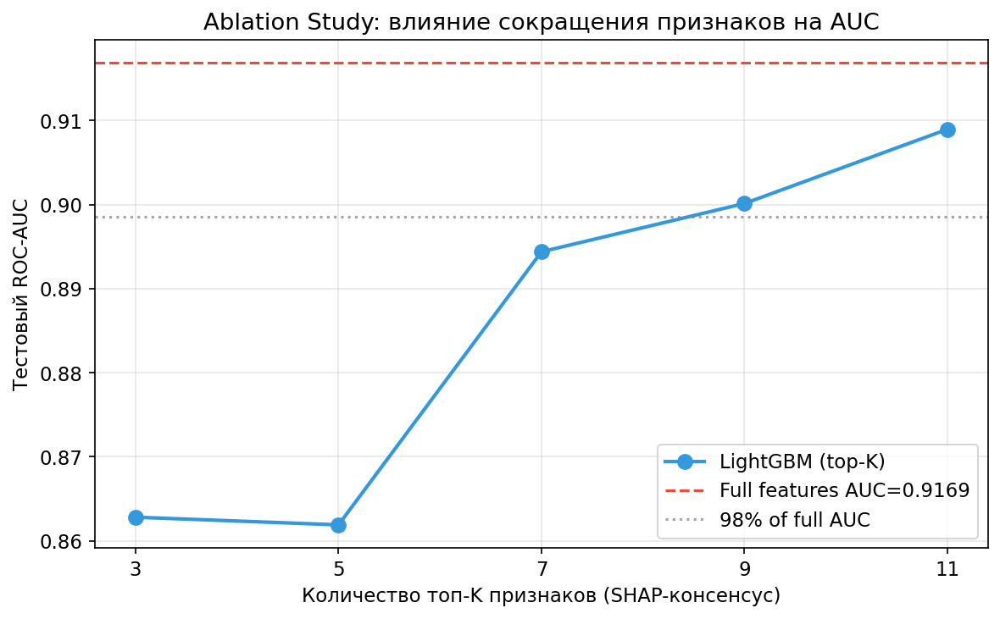
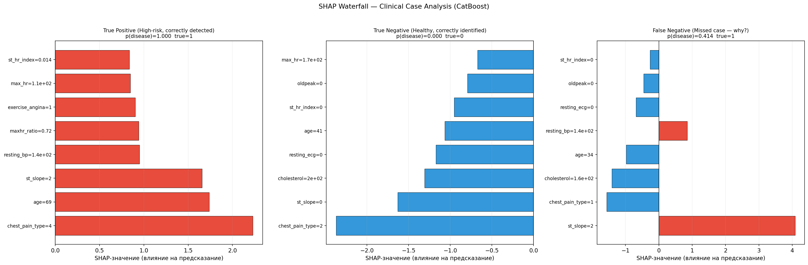
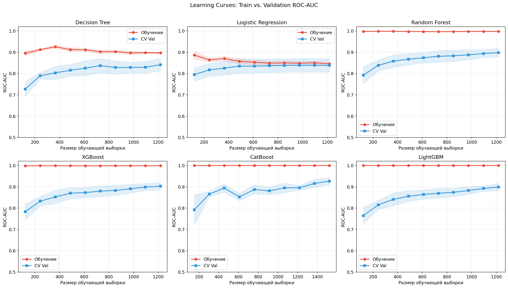

<p align="center">
  <h1 align="center">Классификация сердечно-сосудистых заболеваний</h1>
  <p align="center">Многоцентровый ML-бенчмарк · n = 1 904 · 8 алгоритмов · 6 баз данных</p>
</p>

<p align="center">
  
  
  
  
  
</p>

<p align="center">
  Код и данные для воспроизведения результатов статьи:<br/>
  <b>«Сравнительный анализ алгоритмов машинного обучения для диагностики сердечно-сосудистых заболеваний на многоцентровой выборке»</b><br/>
  Лавьер К.М.
</p>

---

## Основные результаты

| Модель | ROC-AUC | F1 | Точность | Brier |
|---|---|---|---|---|
| **CatBoost** | **0.948** [0.922–0.966] | **0.884** | **0.883** | **0.097** |
| Стекинг | 0.931 [0.901–0.953] | 0.869 | 0.869 | 0.102 |
| Voting | 0.929 [0.897–0.950] | 0.853 | 0.856 | 0.107 |
| XGBoost | 0.924 [0.894–0.947] | 0.837 | 0.838 | 0.112 |
| LightGBM | 0.917 [0.885–0.942] | 0.839 | 0.837 | 0.119 |
| Random Forest | 0.909 [0.876–0.935] | 0.840 | 0.838 | 0.124 |
| Дерево решений | 0.864 [0.823–0.897] | 0.760 | 0.757 | 0.150 |
| Логистическая регрессия | 0.848 [0.806–0.884] | 0.786 | 0.785 | 0.156 |

> 95% BCa бутстреп-доверительные интервалы · Тест DeLong с поправкой Бонферрони (α\* = 0.00179)

---

## Рисунки

<table>
  <tr>
    <td align="center" width="50%">
      
      <br/><sub><b>Рис. 1.</b> ROC-кривые всех 8 классификаторов (тестовая выборка, n = 381)</sub>
    </td>
    <td align="center" width="50%">
      
      <br/><sub><b>Рис. 2.</b> Попарная значимость: тест DeLong (слева) · тест МакНемара (справа)</sub>
    </td>
  </tr>
  <tr>
    <td align="center" width="50%">
      
      <br/><sub><b>Рис. 5.</b> Консенсусное SHAP-ранжирование признаков по 6 моделям</sub>
    </td>
    <td align="center" width="50%">
      
      <br/><sub><b>Рис. 4.</b> Анализ кривых решений — клиническая чистая польза</sub>
    </td>
  </tr>
  <tr>
    <td align="center" width="50%">
      
      <br/><sub><b>Рис. 9.</b> Повторная стратиф. 5×5-CV (25 оценок на модель)</sub>
    </td>
    <td align="center" width="50%">
      
      <br/><sub><b>Рис. 10.</b> Радарная диаграмма: 6 метрик × 8 моделей</sub>
    </td>
  </tr>
</table>

<details>
<summary><b>Показать все рисунки (Рис. 3, 6, 7, 8)</b></summary>

<table>
  <tr>
    <td align="center" width="50%">
      
      <br/><sub><b>Рис. 3.</b> Кривые калибровки (диаграммы надёжности) со значениями ECE</sub>
    </td>
    <td align="center" width="50%">
      
      <br/><sub><b>Рис. 6.</b> Исследование абляции: топ-K SHAP-признаков vs ROC-AUC</sub>
    </td>
  </tr>
  <tr>
    <td align="center" width="50%">
      
      <br/><sub><b>Рис. 7.</b> SHAP-водопад — клинические случаи TP / TN / FN (CatBoost)</sub>
    </td>
    <td align="center" width="50%">
      
      <br/><sub><b>Рис. 8.</b> Кривые обучения: train vs CV ROC-AUC</sub>
    </td>
  </tr>
</table>

</details>

---

## Быстрый старт

```bash
# 1. Клонировать репозиторий
git clone https://github.com/ВАШ_ЛОГИН/ml-heart-classification.git
cd ml-heart-classification

# 2. Установить зависимости
pip install -r requirements.txt

# 3. Запустить ноутбук
jupyter notebook notebook/heart_disease_ml_benchmark.ipynb
```

> **Время выполнения:** ~10–20 мин на CPU (включая подбор гиперпараметров через Optuna).
> **Seed:** `RANDOM_STATE = 42` задан глобально — все разбиения, фолды и модели используют его для полной воспроизводимости.

<details>
<summary><b>Пересборка датасета из сырых источников (опционально)</b></summary>

`heart_combined_clean.csv` уже включён в репозиторий. Запускать только для верификации пайплайна предобработки:

```bash
python build_dataset.py
```

Скрипт объединяет 4 CSV-файла, удаляет дубликаты, импутирует пропуски (медиана/мода) и сохраняет очищенный датасет.

</details>

---

## Датасет

Шесть открытых репозиториев объединены в единую многоцентровую выборку:

<details>
<summary><b>Состав выборки (n = 1 904)</b></summary>

| Источник | Репозиторий | n |
|---|---|---|
| Heart Disease (Cleveland) | UCI ML Repository | 303 |
| Heart Disease (Hungary) | UCI ML Repository | 294 |
| Heart Disease (Switzerland) | UCI ML Repository | 123 |
| Heart Disease (VA Long Beach) | UCI ML Repository | 200 |
| StatLog Heart | UCI ML Repository | 270 |
| Heart Disease | Kaggle | 918 |
| **Итого после дедупликации** | | **1 904** |

**Признаки (11 исходных + 3 производных):**

| Признак | Тип | Описание |
|---|---|---|
| `age` | Числовой | Возраст (лет) |
| `sex` | Бинарный | 1 = мужской, 0 = женский |
| `chest_pain_type` | Категориальный | 1–4 (типичная стенокардия → бессимптомный) |
| `resting_bp` | Числовой | АД в покое (мм рт.ст.) |
| `cholesterol` | Числовой | Холестерин сыворотки (мг/дл) |
| `fasting_bs` | Бинарный | Глюкоза натощак > 120 мг/дл |
| `resting_ecg` | Категориальный | 0 = норма, 1 = ST-T, 2 = гипертрофия ЛЖ |
| `max_hr` | Числовой | Максимальная ЧСС при нагрузке |
| `exercise_angina` | Бинарный | Стенокардия при нагрузке |
| `oldpeak` | Числовой | Депрессия сегмента ST (мВ) |
| `st_slope` | Категориальный | 1 = восходящий, 2 = плоский, 3 = нисходящий |
| `maxhr_ratio` ⭐ | Числовой | `max_hr / (220 − age)` — хронотропный резерв |
| `st_hr_index` ⭐ | Числовой | `oldpeak / (max_hr + 1)` — ST/HR-индекс |
| `angina_st_flag` ⭐ | Бинарный | `[chest_pain_type=0] × [st_slope=2]` |

⭐ Производные признаки, предложенные в данной работе

</details>

---

## Структура репозитория

```
├── data/
│   ├── heart_combined_clean.csv      # Объединённый датасет (n=1 904) — основной вход
│   ├── heart_kaggle.csv              # Сырые данные: Kaggle Heart Disease
│   ├── heart_cleveland.csv           # Сырые данные: Cleveland UCI
│   ├── heart_uci_multicenter.csv     # Сырые данные: UCI многоцентровый (4 клиники)
│   └── heart_statlog.csv             # Сырые данные: StatLog
├── notebook/
│   └── heart_disease_ml_benchmark.ipynb           # Полный эксперимент — воспроизводит все результаты
├── figures/
│   ├── fig1_roc_curves.png
│   ├── fig2_significance_heatmaps.png
│   ├── fig3_calibration.png
│   ├── fig4_decision_curve_analysis.png
│   ├── fig5_shap_consensus.png
│   ├── fig6_ablation.png
│   ├── fig7_shap_waterfall.png
│   ├── fig8_learning_curves.png
│   ├── fig9_repeated_cv.png
│   └── fig10_radar.png
├── tables/
│   ├── model_comparison.csv                       # Все модели: BCa 95% ДИ + тест DeLong
│   └── sota_comparison.csv                        # Сравнение с опубликованными результатами
├── build_dataset.py                               # Пайплайн слияния и очистки данных
└── requirements.txt                               # Зависимости Python
```

---

## Методология

<details>
<summary><b>Модели и протокол обучения</b></summary>

**8 сравниваемых алгоритмов:**
- Дерево решений · Логистическая регрессия · Случайный лес
- XGBoost · LightGBM · CatBoost
- Стекинг (6 базовых моделей, 2 уровня) · Голосующий ансамбль

**Протокол:**
- Стратифицированное разбиение 80/20 (`random_state=42`)
- Подбор гиперпараметров: Optuna (100 проб, стратифицированная 5-кратная CV)
- Оценка: 4 метрики — ROC-AUC, F1, точность (accuracy), оценка Brier
- Доверительные интервалы: BCa бутстреп (n = 2 000 итераций)
- Статистические тесты: DeLong + МакНемара с поправкой Бонферрони
- Устойчивость: повторная стратиф. 5×5-CV (25 оценок), LOSO-валидация по 6 источникам

</details>

<details>
<summary><b>Интерпретируемость (SHAP)</b></summary>

SHAP-значения вычислены для 6 древесных моделей. Консенсусный рейтинг получен усреднением рангов по моделям. Топ-признаки во всех моделях: `st_slope` · `chest_pain_type` · `age` · `st_hr_index`.

Исследование абляции показало: 7 топ-K SHAP-признаков обеспечивают 98% AUC полного набора.

</details>

---

## Цитирование

```bibtex
@article{lavyer2026heart,
  title   = {Сравнительный анализ алгоритмов машинного обучения для диагностики
             сердечно-сосудистых заболеваний на многоцентровой выборке},
  author  = {Лавьер, К.М.},
  journal = {Моделирование, оптимизация и информационные технологии},
  year    = {2026}
}
```

---

## Лицензия

Проект распространяется под лицензией **MIT** — см. файл [LICENSE](LICENSE).
Датасеты получены из [UCI Machine Learning Repository](https://archive.ics.uci.edu/) и [Kaggle](https://www.kaggle.com/) в соответствии с их открытыми лицензиями.
